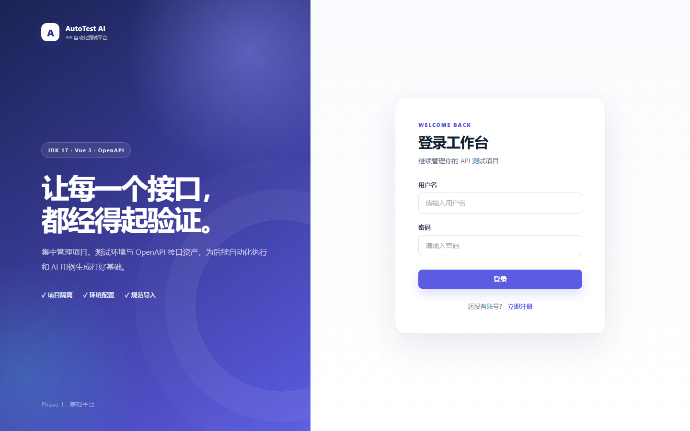
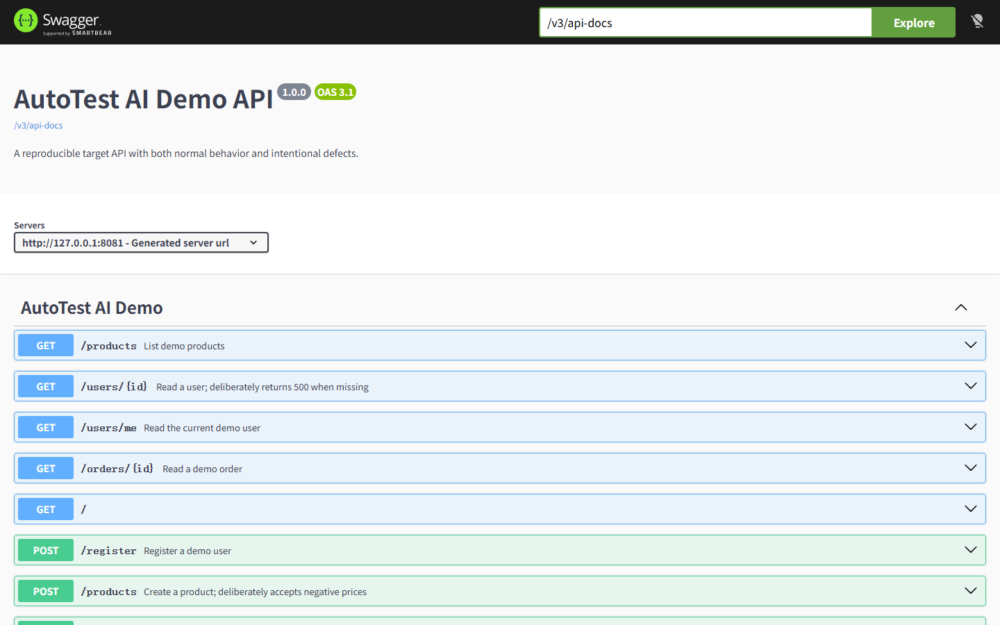
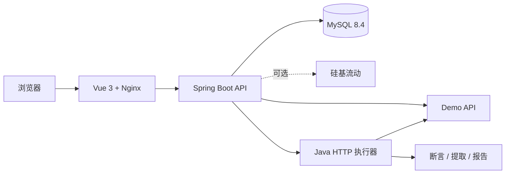
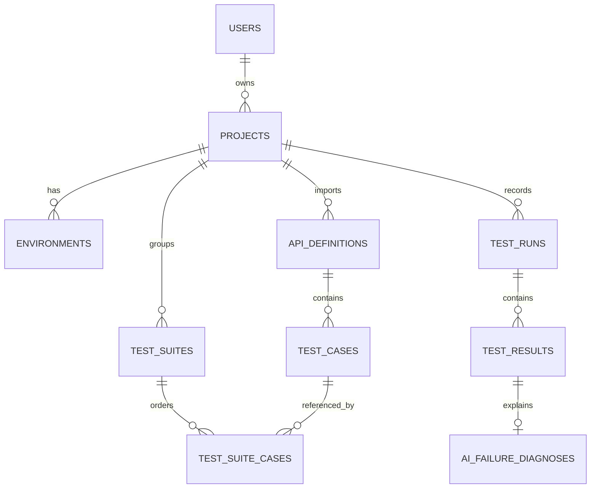

# AutoTest AI


面向个人学习、课程设计和作品集展示的 API 自动化测试平台。它把项目与环境管理、OpenAPI 导入、测试用例设计、真实 HTTP 执行、工作流编排、测试报告和 AI 辅助集中在一个 Web 工作台中。

项目已经达到可发布版本：平台前后端、MySQL 和带有故意缺陷的 Demo API 均可通过 Docker Compose 一键启动；GitHub Actions 会验证 Java 17 后端、Demo API、Vue 生产构建和整套容器健康状态。硅基流动只负责生成候选测试和解释失败，真实请求、断言与 `PASS / FAIL / ERROR` 始终由 Java 执行器确定。

## 项目截图

登录工作台：



用于复现自动化测试流程的 Demo API：



## 系统架构



## 技术栈

| 层次 | 技术 |
| --- | --- |
| 前端 | Vue 3、TypeScript、Vite、Pinia、Vue Router、Axios、Element Plus、Nginx |
| 后端 | Java 17、Spring Boot 3.5、Spring Security、MyBatis、Flyway、Swagger Parser、Spring AI |
| 数据与测试 | MySQL 8.4、JUnit 5、Testcontainers、MockMvc |
| AI | 硅基流动 OpenAI 兼容接口，API Key 仅由运行环境注入 |
| 工程化 | Maven Wrapper、npm、Docker Compose、GitHub Actions |

## 当前目录

```text
autotest-ai/
├── .github/workflows/     # 持续集成与远程回归工作流
├── backend/               # 平台 Spring Boot 后端
├── demo-api/              # 可复现成功及缺陷场景的独立 API
├── docs/images/           # 项目真实运行截图
├── frontend/              # Vue 3 前端及 Nginx 生产镜像
├── docker-compose.yml     # 四服务一键编排
├── .env.example           # 环境变量模板，不包含真实密钥
└── README.md
```

## 本地启动

1. 复制 `.env.example` 为 `.env` 并替换本地数据库密码。
2. 启动 MySQL：

   ```powershell
   docker compose up -d mysql
   ```

3. 运行后端测试：

   ```powershell
   cd backend
   .\mvnw.cmd -s .mvn\settings.xml test
   ```

4. 启动后端（脚本会读取未跟踪的 `.env`，不会输出其中的密钥）：

   ```powershell
   powershell -ExecutionPolicy Bypass -File .\run-local.ps1
   ```

健康检查地址：`http://localhost:18080/actuator/health`。

5. 首次安装前端依赖（缓存保存在 G 盘项目内）：

   ```powershell
   cd ..\frontend
   npm.cmd --cache ..\.npm-cache install
   ```

6. 启动前端：

   ```powershell
   npm.cmd run dev
   ```

浏览器访问 `http://127.0.0.1:5173/`。开发服务器会把 `/api` 和 `/actuator` 请求代理到 `http://127.0.0.1:18080`，因此后端必须保持运行。

默认端口使用 `3307`（MySQL）、`18080`（后端）、`5173`（前端）和 `8081`（Demo API）；部署时均可通过环境变量覆盖。

## Docker Compose 一键启动

项目根目录的 `.env` 保存本机密码、JWT 密钥和可选的硅基流动配置，不会进入 Git。准备好该文件后，在项目根目录执行：

```powershell
docker compose up -d --build
docker compose ps
```

Compose 会按 `MySQL + Demo API healthy → Backend healthy → Frontend healthy` 的顺序启动：

- 前端入口：`http://127.0.0.1:5173/`
- 后端入口：`http://127.0.0.1:18080/`
- 健康检查：`http://127.0.0.1:18080/actuator/health`
- Demo API：`http://127.0.0.1:8081/`
- Demo API Swagger：`http://127.0.0.1:8081/swagger-ui.html`
- Demo API OpenAPI：`http://127.0.0.1:8081/v3/api-docs`
- MySQL：`127.0.0.1:3307`

前端生产镜像由 Node.js 构建静态资源，再使用 Nginx 提供 SPA 路由回退，并把 `/api`、`/actuator` 反向代理到后端容器。后端镜像使用 Java 17 JRE 和非 root 用户运行，启动时通过 Flyway 自动校验或升级数据库。

如果 Docker 中的后端需要导入或测试 Windows 主机上运行的 API，请在项目中使用 `host.docker.internal`，不要使用 `localhost`。Compose 默认放行 `demo-api` 和 `host.docker.internal`，因此内置演示项目应使用 `http://demo-api:8081` 作为 Base URL、使用 `http://demo-api:8081/v3/api-docs` 导入文档。Redis 属于后续可选增强，当前版本不依赖 Redis。

停止服务但保留数据库数据：

```powershell
docker compose down
```

## 五分钟完整演示

1. 执行 `docker compose up -d --build`，打开 `http://127.0.0.1:5173` 并注册账号。
2. 新建项目，Base URL 填写 `http://demo-api:8081`。
3. 在“接口定义”中从 URL 导入 `http://demo-api:8081/v3/api-docs`。
4. 为登录、用户、商品和订单接口创建正常、边界和异常用例；也可以在配置硅基流动后生成候选用例。
5. 新建测试环境，Base URL 同样填写 `http://demo-api:8081`，再运行单用例或有顺序的测试套件。
6. 在测试报告中核对请求、响应、断言、变量提取和失败原因；对失败结果可按需调用 AI 诊断。

Demo API 启动时自带账号 `demo / demo123456` 和商品 `id=1`，数据保存在内存中，重启容器即可复位。它故意保留以下问题，方便稳定复现失败报告：

- 查询不存在的用户返回 `500`，而不是 `404`。
- 创建商品时接受负数价格。
- 创建订单时接受数量 `0`。
- 无效 Bearer Token 返回 `500`，而不是 `401`。

## CI / CD 集成

`.github/workflows/ci.yml` 在推送和 Pull Request 时并行执行：

- Java 17 平台后端测试；
- Java 17 Demo API 测试；
- Vue TypeScript 检查与生产构建；
- 完整 Docker Compose 构建、健康等待和三个公开入口的冒烟测试。

`.github/workflows/platform-regression.yml` 可在 GitHub Actions 中手动触发已部署平台的测试套件。仓库 Secret `AUTOTEST_TOKEN` 保存平台 JWT，工作流参数指定平台地址、项目、套件和环境；最终状态不是 `PASS` 时任务会失败，从而把 AutoTest AI 接入现有发布流水线。

## 前端功能

- 注册、登录、JWT 持久化、登录失效自动返回登录页。
- 项目列表，以及项目的新建、编辑、删除和工作台。
- 测试环境的新建、编辑、删除，支持字符串请求头和环境变量 JSON。
- 从 URL 或 `.json`、`.yaml`、`.yml` 文件导入 OpenAPI/Swagger 文档。
- 按关键词、HTTP 方法和标签筛选接口，并查看参数、请求体、响应和安全定义。
- 按 API 新建、查询、编辑和删除测试用例，维护请求头、路径参数、查询参数与 JSON 请求体。
- 配置状态码、JSONPath、响应时间和正文内容断言，以及后续接口依赖使用的响应变量提取规则。
- 选择测试环境异步运行单条用例，轮询运行状态，并查看请求、响应、断言结果和提取变量。
- 创建并排序测试套件，配置步骤启用状态与失败策略，异步运行完整 API Workflow 并逐步查看结果。
- 调用硅基流动生成正常、边界、异常、缺参、类型错误和认证候选用例，预览并选择后再导入数据库。
- 查询单用例和测试套件的执行历史，查看汇总指标并按 API 展开完整结果与 AI 诊断。
- 在 Dashboard 汇总当前用户的测试资产、近 7 天运行情况、总体通过率和最近失败测试。
- 使用连续 7 天趋势图展示通过率和平均响应时间，并列出近 7 天失败最多的 5 个 API。

前端技术栈为 Vue 3、TypeScript、Vite、Vue Router、Pinia、Axios 和 Element Plus。生产构建命令：

```powershell
cd frontend
npm.cmd run build
```

## 认证接口

- `POST /api/auth/register`：注册用户并返回 JWT。
- `POST /api/auth/login`：用户名和密码登录并返回 JWT。
- `GET /api/users/me`：使用 `Authorization: Bearer <token>` 获取当前用户。
- `PUT /api/users/me`：修改当前用户邮箱和显示名称。

JWT 使用 HS256 签名；`JWT_SECRET` 必须从环境变量或未跟踪的 `.env` 注入，且至少为 32 个 UTF-8 字节。用户密码只保存经 Spring Security `DelegatingPasswordEncoder` 处理后的 BCrypt 哈希。

## 项目接口

- `POST /api/projects`：创建当前用户的项目。
- `GET /api/projects`：查询当前用户的项目列表。
- `GET /api/projects/{projectId}`：查询属于当前用户的项目详情。
- `PUT /api/projects/{projectId}`：修改属于当前用户的项目。
- `DELETE /api/projects/{projectId}`：删除属于当前用户的项目。

项目名称在同一用户下唯一。所有详情、修改和删除操作均在 Mapper 与 Service 层同时校验 `projectId + userId`；访问其他用户的项目统一返回 `404`，避免泄漏资源是否存在。Base URL 只接受不包含账号信息或片段的绝对 HTTP/HTTPS 地址。

## 测试环境接口

- `POST /api/projects/{projectId}/environments`：为当前用户的项目创建环境。
- `GET /api/projects/{projectId}/environments`：查询项目的环境列表。
- `GET /api/projects/{projectId}/environments/{environmentId}`：查询环境详情。
- `PUT /api/projects/{projectId}/environments/{environmentId}`：修改环境。
- `DELETE /api/projects/{projectId}/environments/{environmentId}`：删除环境。

环境名称在同一项目下唯一，可保存独立的 Base URL、请求头和字符串变量。例如：

```json
{
  "name": "Development",
  "baseUrl": "http://localhost:8081",
  "headers": {
    "Content-Type": "application/json"
  },
  "variables": {
    "token": "dev-token",
    "user_id": "1001"
  }
}
```

环境接口会先校验项目归属，再以 `projectId + environmentId + userId` 限定资源操作；跨用户访问统一返回项目不存在。请求头禁止换行注入，执行器会将环境变量用于 URL、请求头、查询参数和 JSON 请求体中的 `{{token}}`、`{{user_id}}` 模板替换。

## OpenAPI / Swagger 导入接口

- `POST /api/projects/{projectId}/apis/import/url`：从允许的 HTTP/HTTPS 地址导入文档。
- `POST /api/projects/{projectId}/apis/import/file`：上传 `.json`、`.yaml` 或 `.yml` 文档。
- `GET /api/projects/{projectId}/apis`：查询已解析的接口列表。
- `GET /api/projects/{projectId}/apis/{apiId}`：查询接口参数、请求体、响应结构和安全要求。

解析层使用 Swagger Parser，同时支持 OpenAPI 3.x 和 Swagger 2.0。每个 Operation 会转换并保存 `method`、`path`、`operationId`、`summary`、`description`、`tags`、`parameters`、`requestBody`、`responses` 与 `security`。重复导入相同的 `method + path` 会更新已有记录，不会生成重复接口。

URL 导入默认只允许 `localhost` 和 `127.0.0.1`，不跟随重定向，并限制连接时间、读取时间和文档大小。需要导入其他主机时，应显式设置 `OPENAPI_IMPORT_ALLOWED_HOSTS`，多个主机以逗号分隔。解析器不会主动解析外部 `$ref`，避免导入过程发起未经允许的额外网络请求。

## 测试用例接口

- `POST /api/projects/{projectId}/apis/{apiId}/test-cases`：为指定 API 创建测试用例。
- `GET /api/projects/{projectId}/apis/{apiId}/test-cases`：查询指定 API 的测试用例列表。
- `GET /api/projects/{projectId}/apis/{apiId}/test-cases/{testCaseId}`：查询测试用例详情。
- `PUT /api/projects/{projectId}/apis/{apiId}/test-cases/{testCaseId}`：按版本号更新测试用例。
- `DELETE /api/projects/{projectId}/apis/{apiId}/test-cases/{testCaseId}`：删除测试用例。

用例类型包括正常、边界、异常、缺少参数、类型错误和认证场景。每条用例可保存请求头、路径参数、查询参数、JSON 请求体以及以下断言：HTTP 状态码、JSONPath 存在、JSONPath 值相等、JSON 值类型、响应时间上限和正文包含文本。响应变量提取规则由安全变量名与 JSONPath 组成。

同一 API 下的用例名称唯一；所有操作都会同时校验项目、API、用例与当前用户的归属关系。更新使用 `version` 乐观锁，编辑旧版本会返回 `409 STALE_TEST_CASE_VERSION`，防止覆盖其他人的最新修改。

## AI 候选用例生成

- `GET /api/ai/status`：返回硅基流动是否已配置及当前模型，不返回 API Key。
- `POST /api/projects/{projectId}/apis/{apiId}/ai/test-cases/generate`：根据接口定义、请求/响应 Schema、安全定义、已有用例以及可选重点要求生成 1–12 条候选用例。

后端使用统一 `AiService` 调用 Spring AI `ChatClient`，并将硅基流动输出映射为 Java Record。候选结果会先经过 Bean Validation，再复用现有测试用例执行配置校验；结构错误、非法断言或不可执行的候选不会入库。重复名称会在返回前安全改名。提示词只发送接口设计数据和已有用例摘要，不发送运行环境密钥或真实执行结果。

在项目根目录未跟踪的 `.env` 中填写以下两项并重启后端即可启用：

```dotenv
SILICONFLOW_API_KEY=你的硅基流动_API_Key
SILICONFLOW_MODEL=模型广场中的完整模型名称
```

`SILICONFLOW_BASE_URL` 默认是 `https://api.siliconflow.cn/v1`，`SILICONFLOW_MAX_TOKENS` 默认 4096，`SILICONFLOW_TIMEOUT` 默认 90 秒。前端只有在用户点击并确认导入后才保存候选用例，之后仍可在现有编辑器修改，并由 Java 执行器发起请求和计算断言结果。

## 单用例执行接口

- `POST /api/projects/{projectId}/apis/{apiId}/test-cases/{testCaseId}/runs`：选择环境并提交一次异步执行，立即返回 `202` 和运行记录。
- `GET /api/projects/{projectId}/test-runs/{runId}`：查询 `PENDING`、`RUNNING`、`PASS`、`FAIL` 或 `ERROR` 状态及完整结果。

执行器从环境 Base URL（未选择环境时使用项目 Base URL）和接口路径组装请求，合并环境/用例请求头，替换 `{{变量}}`，再通过 Spring `RestClient` 发起真实 HTTP 请求。后台任务使用独立线程池；HTTP 等待期间不持有数据库事务，开始与结束状态分别在短事务中保存。

执行结果保存实际请求方法、URL、脱敏后的请求头与请求体，以及响应状态、响应头、响应体、耗时、逐条断言结果、提取变量和错误信息。HTTP 4xx/5xx 仍按正常响应进入断言；网络错误、超时、模板变量缺失或响应体超限记录为 `ERROR`。支持状态码、JSONPath 存在/相等/类型、响应时间和正文包含六类断言。

默认只允许请求 `localhost` 与 `127.0.0.1`，并拒绝非 HTTP/HTTPS、账号信息、片段和重定向。可通过 `TEST_EXECUTION_ALLOWED_HOSTS` 显式增加目标主机；连接超时、读取超时、最大响应体和执行线程池均可使用 `.env.example` 中的 `TEST_EXECUTION_*` 变量调整。`Authorization`、Cookie、API Key 以及名称包含 token/secret 的请求头在入库前会被脱敏。

## AI 失败诊断

- `GET /api/projects/{projectId}/test-runs/{runId}/results/{resultId}/ai/diagnosis`：读取已经保存的结构化诊断。
- `POST /api/projects/{projectId}/test-runs/{runId}/results/{resultId}/ai/diagnosis`：为指定失败步骤生成或重新生成诊断。

诊断只允许用于 `FAIL` 或 `ERROR` 结果，`PASS` 结果会返回 `409 AI_DIAGNOSIS_NOT_APPLICABLE`。后端从数据库读取 API 定义、测试用例、实际请求、期望断言、实际响应、断言结果和执行错误，不接受前端自行提交诊断上下文，避免用户篡改证据。模型输出固定映射为问题摘要、严重程度、可能原因、建议检查位置和修复建议，并经过 Bean Validation 后保存到 `ai_failure_diagnoses`。

进入模型前，请求头会再次脱敏；请求体、响应体和错误文本中的密码、Token、Secret、API Key、Authorization 与 Cookie 字段也会递归脱敏，并对长正文进行截断。AI 结果是排查建议，不会覆盖 Java 执行器保存的 `PASS / FAIL / ERROR` 状态。前端在测试结果窗口中展示已有诊断，用户主动点击后才会调用模型并保存结果。

## 测试套件与接口依赖

- `POST /api/projects/{projectId}/test-suites`：创建有顺序的测试套件。
- `GET /api/projects/{projectId}/test-suites`：查询项目套件及其步骤。
- `GET /api/projects/{projectId}/test-suites/candidates`：查询可加入套件的项目测试用例。
- `GET /api/projects/{projectId}/test-suites/{suiteId}`：查询套件详情。
- `PUT /api/projects/{projectId}/test-suites/{suiteId}`：按 `version` 乐观锁更新名称、失败策略和步骤顺序。
- `DELETE /api/projects/{projectId}/test-suites/{suiteId}`：删除尚无执行历史的套件。
- `POST /api/projects/{projectId}/test-suites/{suiteId}/runs`：选择环境并提交后台套件执行。

套件由同一个 `ThreadPoolTaskExecutor` 后台任务顺序编排，但每个 HTTP 步骤仍只在必要的短事务中保存状态和结果。前序响应按 JSONPath 提取后写入本次 Test Run 的运行时变量上下文；后续 URL、路径参数、查询参数、请求头和 JSON 请求体中的 `{{variable}}` 会优先使用该运行时值，从而覆盖同名环境变量。

当 `stopOnFailure=true` 时，首个 `FAIL` 或 `ERROR` 会终止后续步骤；关闭后则继续执行并汇总最终状态。运行记录保存计划总数、通过/失败/错误计数、执行顺序和每一步的完整结果。单套件默认最多 50 条用例，可通过 `TEST_SUITE_MAX_CASES` 调整，允许范围为 1–500。

## 测试报告接口

- `GET /api/projects/{projectId}/test-reports?limit=30`：查询当前用户项目最近的执行报告，`limit` 允许 1–100。
- `GET /api/projects/{projectId}/test-reports/{runId}`：查询一份报告的汇总、原始运行记录和按 API 分组的步骤结果。

报告直接复用已持久化的执行历史，不重复执行测试。汇总包含总数、已执行、跳过、通过、失败、错误、通过率和平均响应时间；按 API 展开后可继续查看每一步的 Request、Response、断言、变量提取和 AI 失败诊断。列表和详情均校验当前用户的项目归属，跨用户报告不会泄露。

## Dashboard 接口

- `GET /api/dashboard/summary`：查询当前登录用户的 Dashboard 汇总和最近 8 条失败测试。

Dashboard 的“最近执行”统计近 7 天创建的运行记录；“总体通过率”使用全部已完成运行的 `passed_count / total_count` 计算，并与测试报告保持相同口径。最近失败列表同时包含 `FAIL` 和 `ERROR`，返回所属项目、API、测试用例、HTTP 状态、响应时间与执行时间。所有查询都通过项目所属用户过滤，不会混入其他账号数据。

增强统计会返回连续 7 个自然日：当天没有已完成运行或有效响应时，对应趋势值为 `null`，前端显示为空数据而不是伪造为 0。失败 API 排名统计近 7 天每个接口的 `FAIL + ERROR` 次数，并同时返回总执行次数和失败率，默认展示前 5 名。

## 安全约束

- `.env`、API Key、密码和 Token 不进入 Git。
- JWT 验签失败或缺失返回 `401`，受保护接口不创建服务端 Session。
- OpenAPI 文件默认限制为 5 MB；URL 导入采用主机白名单并拒绝携带账号信息或片段的地址。
- 测试执行采用独立目标主机白名单、超时、响应体上限和敏感请求头脱敏，且不自动跟随重定向。
- 测试套件限制最大用例数；套件、用例、环境和执行历史均执行当前用户项目归属校验。
- AI 失败诊断只读取用户所属项目中已持久化的失败结果，并在调用模型前二次脱敏和截断正文。
- 硅基流动真实 `SILICONFLOW_API_KEY` 只由运行环境注入，状态接口和日志均不返回密钥。
- 当前迁移脚本仅通过 Flyway 管理，不手工修改数据库结构。

## 数据模型



数据库结构由 `backend/src/main/resources/db/migration` 下的 Flyway 脚本按版本创建，包含用户与项目隔离、OpenAPI 资产、测试环境、乐观锁用例、套件步骤、异步运行结果和 AI 诊断。

## 项目亮点

- 从 OpenAPI 资产到报告的完整闭环，而不只是一个 HTTP 请求工具。
- 测试套件支持 JSONPath 变量提取、`{{variable}}` 传递和失败即停。
- 真实网络访问带目标白名单、超时、响应体上限、禁止重定向和敏感头脱敏。
- 所有业务资源按当前用户隔离；JWT、密码和 AI Key 不写入仓库。
- AI 与确定性测试执行解耦：没有模型配置时平台仍可完整运行。
- 独立 Demo API、集成测试、容器健康检查和 GitHub Actions 让演示结果可重复。

## 后续计划

- 支持定时任务、邮件或 Webhook 通知。
- 增加运行队列、Redis 缓存和多执行节点。
- 支持更多协议、参数化数据集和报告导出。
- 增加团队、角色、权限和审计日志。
